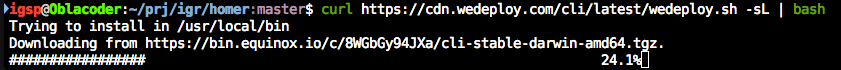
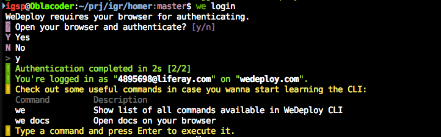

# WeDeploy CLI

The WeDeploy Command-Line Interface is a tool for helping you use the WeDeploy platform by providing support for things like creating, managing, and scaling applications.

If you use a Unix-like operating system such as macOS or Linux, open your terminal and run:

```shell
curl https://cdn.wedeploy.com/cli/latest/wedeploy.sh -sL | bash
```



For more details and instructions about installation on other platforms, check the official documentation: [Using the Command-line](https://wedeploy.com/docs/intro/using-the-command-line/).

## Login from CLI

We must first tell the CLI who we are. Let's login:

```shell
we login
```

Follow the procedure of logging in.



Note that you need to have a confirmed WeDeploy account, otherwise the login (and the rest of the workshop) will not work.


---

[continue...](02-the-first-service.md)
