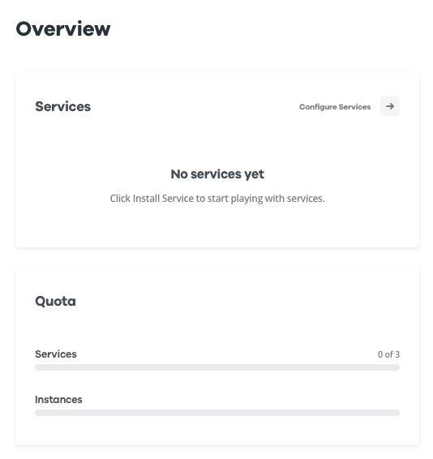
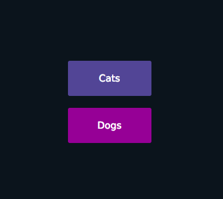
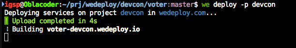
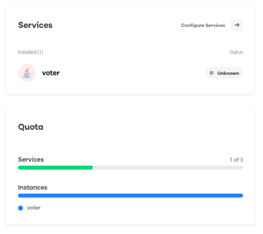

# The First Service

We are going to build a simple Java application as our first WeDeploy service.
It's a simple hello-world Spring Boot application.


## Project creation

First thing first - we need a project. Go to [wedeploy.com](http://wedeploy.com) and create a new project.

We are going to name the project as: `devcon`.



However, your project name must be unique, so you can not all use the very same name. We propose to follow this pattern for naming the project: `<your_handle>devcon`.


## The First Java service

Let's now prepare a Java service locally. Create a root folder for the project.


```shell
mkdir devcon
```

To save some time, we already have a boilerplate project ready! Clone this repository and head to `voter` directory:

```bash
git clone --depth 1 https://github.com/wedeploy/devcon
cd ./devcon/voter
```

Like we said above, this is a simple Java project, based on Spring Boot. There is nothing WeDeploy related in it. 

You can build it and run it like any other Java application:


```bash
./gradlew build
./gradlew run
```

The application should be running at port `8080`. Check it in your [browser](http://localhost:8080):



Note.: if you already have something running on port `8080` you must close it. To discover if that's the case, run `sudo lsof -i:8080`.


## WeDeployment!

It's time to deploy our Java service!

Edit or add a `wedeploy.json` file in the service's folder (`voter`):


```json
{
  "id": "voter"
}

```

This file is NOT mandatory; we have added it just to get familiar with it. It is used for WeDeploy deployment configurations. In this example, we just set the service name (`id`).

Deployment is super easy with the WeDeploy CLI:


```bash
we deploy -p devcon
# ps.: at 'devcon/voter'
# pps.: change `devcon` by the name of your project
```



Go to the [WeDeploy Console](http://console.wedeploy.com) and check what's happening!



---

[continue...](03-add-the-data.md)
