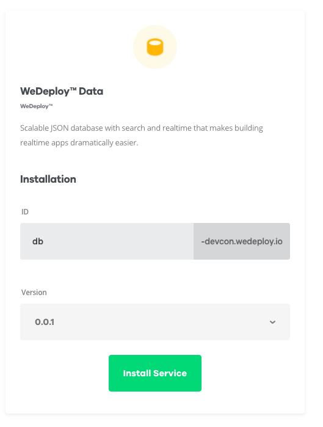

# Data Service

Every app needs it's data storage, so our app will need one too. Fortunately, WeDeploy offers a no-sql data service out-of-the-box! You can simply install it and add it to your project with a few clicks. Let's do that now.

Go to the project's page in the Console and click on the button to install a new service. Select the **WeDeploy Data** service.

Choose the name for the service: `db`. Click on the install button and... just sit and relax. After few moments the data service will be up and ready.

The project's page looks like this now:

Let's put it in use!

---

[continue...](04-voter.md)
